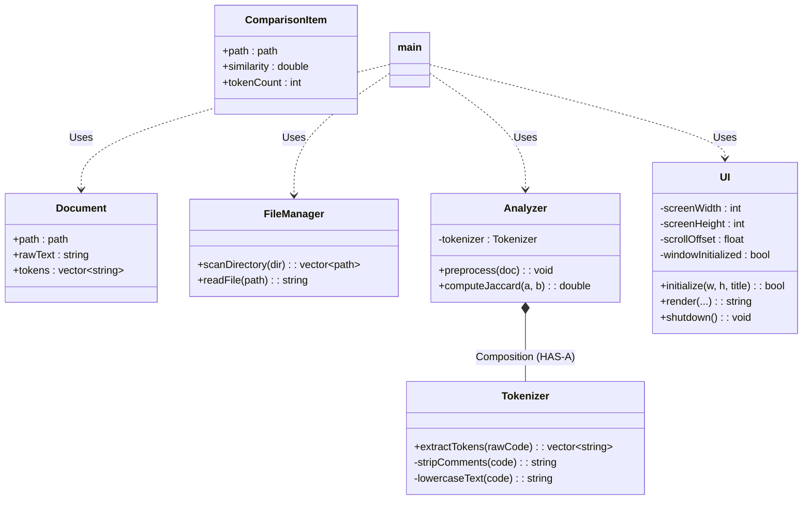

# Plagiarism Detection System: OOP & Class Documentation

This reference guide explains the object-oriented architecture, components, and design principles underpinning the C++ Plagiarism Detection System.

---

## 1. Class & Struct Reference

The codebase is organized under the `pd` (Plagiarism Detection) namespace to isolate interfaces and avoid naming collisions with external libraries like Raylib and the Windows API.



### 1.1 Model & Data Components
These are structured representations of data, implemented as Plain Old C++ Structs (PODs) since they function primarily as data holders rather than behavioral objects.

#### Struct `pd::Document`
* **Defined in**: [Document.hpp](file:///c:/Users/saksham/.vscode/MARK/Project-2/include/Document.hpp)
* **Purpose**: Holds file contents and its structural representation at different stages of the pipeline.
* **Fields**:
  * `std::filesystem::path path`: Absolute/relative file system path.
  * `std::string rawText`: Unmodified, raw source code loaded from disk.
  * `std::vector<std::string> tokens`: Clean, parsed token array generated after preprocessing.

#### Struct `pd::ComparisonItem`
* **Defined in**: [UI.hpp](file:///c:/Users/saksham/.vscode/MARK/Project-2/include/UI.hpp)
* **Purpose**: Represents a ranked match result displayed inside the database view.
* **Fields**:
  * `std::filesystem::path path`: Path of the database file.
  * `double similarity`: Computed Jaccard index ratio `[0.0, 1.0]`.
  * `int tokenCount`: Number of structural tokens in this database file.

---

### 1.2 Service & Core Logic Components
These are classes that encapsulate operations, algorithms, and file interfaces.

#### Class `pd::FileManager`
* **Defined in**: [FileManager.hpp](file:///c:/Users/saksham/.vscode/MARK/Project-2/include/FileManager.hpp) / [FileManager.cpp](file:///c:/Users/saksham/.vscode/MARK/Project-2/src/FileManager.cpp)
* **Purpose**: Encapsulates file-system operations.
* **Key Methods**:
  * `std::vector<std::filesystem::path> scanDirectory(const std::filesystem::path& dir)`: Scans the target directory, filters for `.cpp` and `.txt` files, and returns a list.
  * `std::string readFile(const std::filesystem::path& path)`: Safely opens a file stream, reads the buffer, and returns it as a string.

#### Class `pd::Tokenizer`
* **Defined in**: [Tokenizer.hpp](file:///c:/Users/saksham/.vscode/MARK/Project-2/include/Tokenizer.hpp) / [Tokenizer.cpp](file:///c:/Users/saksham/.vscode/MARK/Project-2/src/Tokenizer.cpp)
* **Purpose**: Standardizes source code syntax into logical, comparable syntax units (tokens).
* **Key Methods**:
  * `std::vector<std::string> extractTokens(const std::string& rawCode)`: Parses raw code character-by-character.
  * `std::string stripComments(const std::string& code)` *(Private)*: Strips single-line (`//`) and block (`/* */`) comments. Normalizes string/character literals to `"STR"` and `"CHR"`.
  * `std::string lowercaseText(const std::string& code)` *(Private)*: Lowercases all letters to support case-insensitive checks.

#### Class `pd::Analyzer`
* **Defined in**: [Analyzer.hpp](file:///c:/Users/saksham/.vscode/MARK/Project-2/include/Analyzer.hpp) / [Analyzer.cpp](file:///c:/Users/saksham/.vscode/MARK/Project-2/src/Analyzer.cpp)
* **Purpose**: Compares documents mathematically.
* **Key Methods**:
  * `void preprocess(Document& doc)`: Tokenizes raw text and saves it inside the `doc.tokens` structure.
  * `double computeJaccard(const Document& a, const Document& b)`: Converts token lists into unique sorted sets (`std::set`). Computes the set intersection and union. Jaccard Index is calculated as:
    $$\text{Jaccard}(A, B) = \frac{|A \cap B|}{|A \cup B|}$$

---

### 1.3 View & Presentation Components

#### Class `pd::UI`
* **Defined in**: [UI.hpp](file:///c:/Users/saksham/.vscode/MARK/Project-2/include/UI.hpp) / [UI.cpp](file:///c:/Users/saksham/.vscode/MARK/Project-2/src/UI.cpp)
* **Purpose**: Directs all GLFW window setups, Raylib graphics renderings, hover states, scroll bars, and scroll click offsets.
* **Key Methods**:
  * `bool initialize(int width, int height, const std::string& title)`: Sets window resolution, builds the GLFW rendering context, and caps the refresh speed to 60 FPS.
  * `std::string render(...)`: The main drawing interface. Draws the active comparison gauge, status badges, details panel, and database matching cards. Features a scissor-clipped viewport to scroll through items, custom mouse-pointer toggling on hover, and returns file paths when the upload button is clicked.
  * `void shutdown()`: Releases graphics buffers and closes the window.

---

## 2. OOP Principles Applied in the Project

The system leverages object-oriented programming to make the code modular, maintainable, and easy to extend.

### 2.1 Encapsulation (Information Hiding)
Encapsulation means bundling data and operations inside a class and restricting direct access to internal states.
* **Implementation**: Classes like `pd::UI`, `pd::Analyzer`, and `pd::Tokenizer` keep their internal variables and helper functions `private`.
  * The outside caller doesn't need to know how many pixels the window width is (`UI::screenWidth`), nor modify the database scroll position (`UI::scrollOffset`) directly.
  * The comment-stripper (`Tokenizer::stripComments`) is kept private because other classes only care about the final tokens list via `Tokenizer::extractTokens`.
* **Benefit**: Prevents bugs where external code changes internal class variables, which could cause inconsistent state.

### 2.2 Abstraction
Abstraction hides low-level complexity behind high-level, human-readable interfaces.
* **Implementation**: The main orchestrator ([main.cpp](file:///c:/Users/saksham/.vscode/MARK/Project-2/main.cpp)) works entirely at a conceptual level:
  * It initializes modules (`ui.initialize(...)`).
  * It requests document comparisons (`analyzer.computeJaccard(...)`).
  * It calls `ui.render(...)`.
  The controller does not care how file streams are read, how Raylib renders shapes, or how the native Windows file chooser dialog is instantiated.
* **Benefit**: If we replace Raylib with another GUI library (e.g., SDL or Qt), we only need to rewrite `UI.cpp`. The core comparison logic in `main.cpp` and `Analyzer.cpp` remains completely unchanged.

### 2.3 Composition (HAS-A Relationship)
Composition builds complex objects by combining simpler objects.
* **Implementation**: The `pd::Analyzer` class contains a `pd::Tokenizer` object as a private member variable:
  ```cpp
  class Analyzer {
  private:
      Tokenizer tokenizer; // Composition
  ...
  ```
  The `Analyzer` delegates the tokenization task to its internal `Tokenizer` object when preparing files.
* **Benefit**: Encourages reuse. The tokenizer logic is isolated in its own class but is utilized seamlessly by the analyzer.

### 2.4 Separation of Concerns (MVC Pattern)
While not a strict textbook MVC structure, the project follows this architectural pattern:
* **Model (Data)**: `pd::Document` and `pd::ComparisonItem` represent the pure data layer.
* **View (Presentation)**: `pd::UI` manages formatting, layout, buttons, and graphics.
* **Controller (Coordination)**: `main.cpp` handles program setup, directory watching, file loading, and state orchestration.
* **Services (Utility)**: `pd::FileManager` and `pd::openFileDialog()` provide specialized utilities.

---

## 3. Troubleshooting compilation errors

If you compile the project by running:
```bash
g++ -std=c++17 main.cpp -o game.exe ...
```
You will get **undefined reference** errors. 

### Why did it fail?
In C++, compiling only the `main.cpp` file does not automatically compile other implementation files (`.cpp`). The linker throws errors because it cannot find the machine code compiled for the classes declared in `main.cpp` (e.g., `pd::UI`, `pd::Analyzer`, `pd::FileManager`).

### How to compile correctly:
You must compile **all** source files together. Use the pre-configured compilation script:
```powershell
.\build.bat
```
The script compiles all files in the `src/` directory and links them with Raylib and the required Windows libraries:
```bash
g++ -std=c++17 main.cpp src/Analyzer.cpp src/Tokenizer.cpp src/FileManager.cpp src/UI.cpp src/Document.cpp src/FileDialog.cpp -o plagiarism.exe -I include -I raylib/src -L raylib/src -lraylib -lopengl32 -lgdi32 -lwinmm -lcomdlg32
```
*Notice `-lcomdlg32` at the end; this is required to link the native Windows file selector dialog.*
