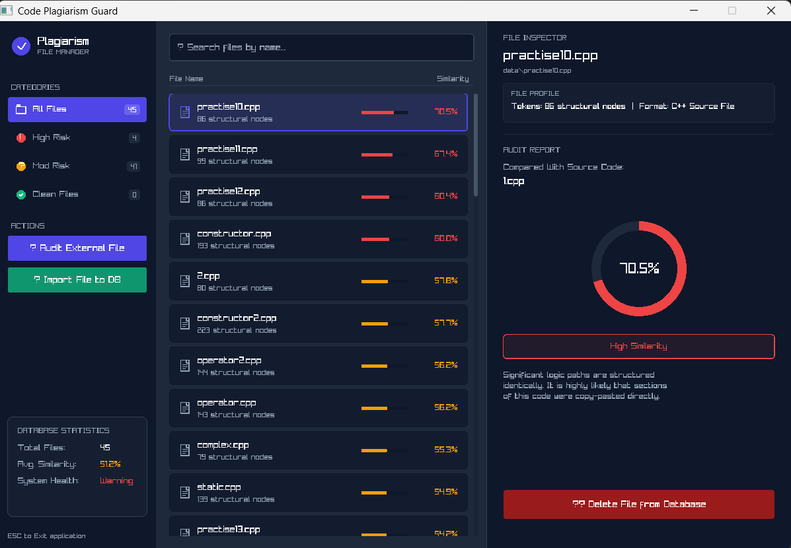

# C++ Plagiarism Detector

A desktop application built with C++ and Raylib to scan and compare source code files. It uses a token-based Jaccard similarity algorithm to check how closely two C++ files are structured.

## Features

- **Token-based comparison**: Instead of just checking raw text, the program tokenizes the code first. This means it can still catch copied code even if variable names were changed or comments/formatting were modified.
- **Jaccard Similarity**: Calculates the ratio of shared tokens between two files:
  ```
  J(A, B) = |A ∩ B| / |A ∪ B|
  ```
- **Live directory watching**: The app monitors the `data/` folder. If you add, edit, or delete files, the dashboard updates immediately.
- **Interactive UI**: Built with Raylib, featuring:
  - Sidebar filters for different risk levels (All Files, High Risk, Moderate Risk, Clean).
  - Search bar to filter the file list by name.
  - File comparison details showing similarity scores and badge summaries.
  - Actions to audit files outside the database, import new files, or delete existing ones.

## Screenshots

### Main Dashboard
Here is what the interface looks like showing the list of compared files and details for the selected match:



## Repository Structure

- `data/` - Folder containing the database files to scan.
- `include/` - Header files (`UI.hpp`, `Analyzer.hpp`, etc.).
- `src/` - Implementation source code files.
- `raylib/` - Local Raylib dependencies.
- `build.bat` - Simple build script for Windows.
- `main.cpp` - Entry point and core application loop.

## How to Build and Run

### Prerequisites
- Windows OS
- GCC compiler (`g++`) with C++17 support installed in your PATH.

### Building the project
Run the batch file in PowerShell or Command Prompt:
```powershell
.\build.bat
```
This will compile the source code and generate `plagiarism.exe`.

### Running the app
Once compiled, run the executable:
```powershell
.\plagiarism.exe
```
Or open the folder in VS Code and press `F5` to debug.

## Team members
- Saksham Mandal
- Alex Adhikari
- Sumit Kr. Shah
