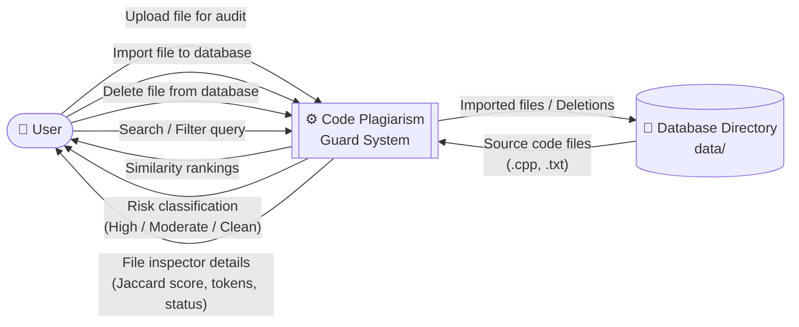
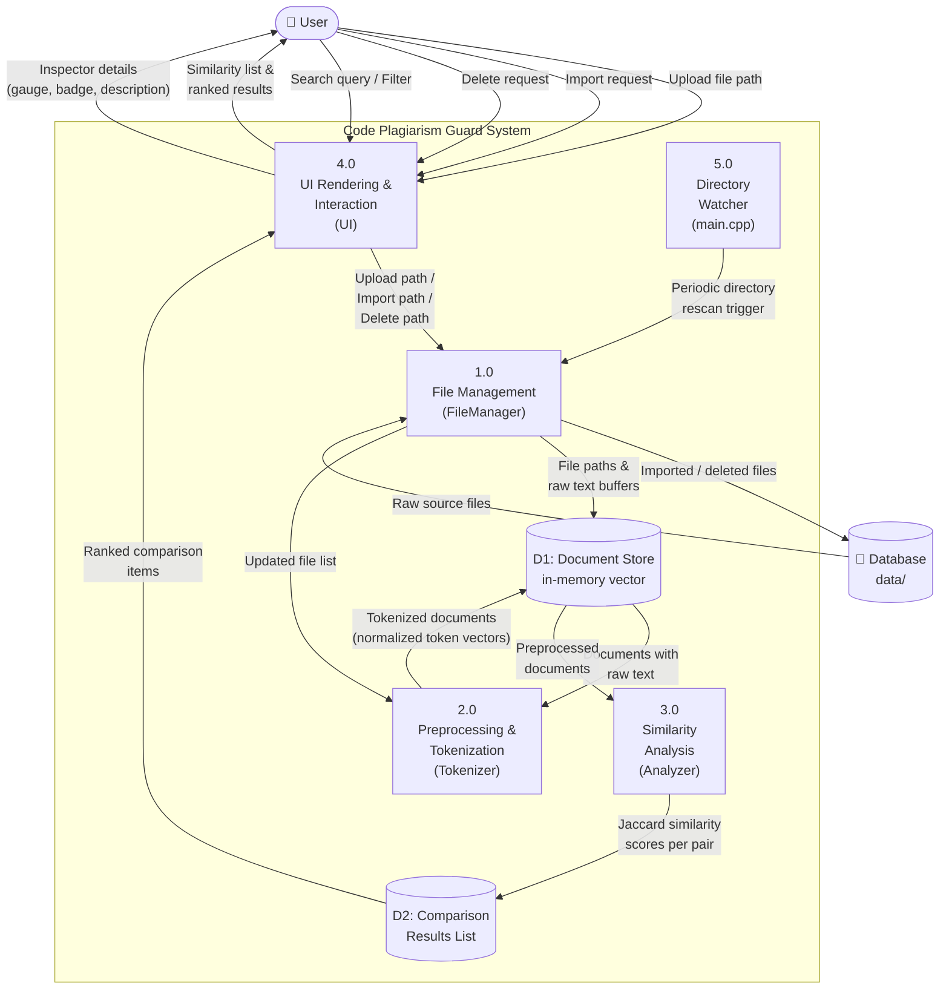
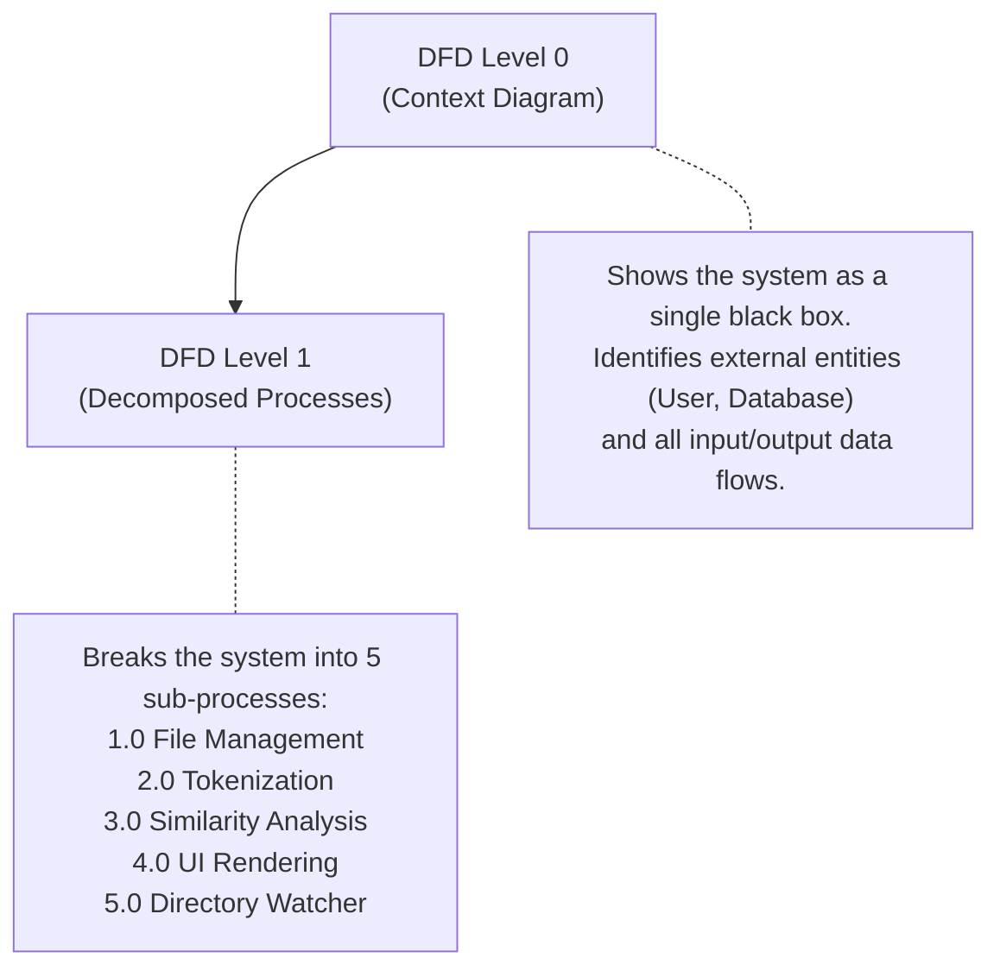

# Code Plagiarism Guard — Data Flow Diagrams (DFD)

This document presents the **Level 0 (Context Diagram)** and **Level 1 (Decomposed Process Diagram)** Data Flow Diagrams for the Code Plagiarism Guard system.

---

## DFD Level 0 — Context Diagram

The Level 0 DFD shows the system as a single process interacting with external entities. It establishes the boundary of the system and identifies all inputs and outputs.

### Level 0 — Entity & Flow Descriptions

| Element | Type | Description |
|---|---|---|
| **User** | External Entity | The person interacting with the desktop application via mouse clicks, keyboard search, and file dialog selections. |
| **Database Directory (`data/`)** | Data Store | The local filesystem folder containing all C++ source files that serve as the plagiarism reference corpus. |
| **Code Plagiarism Guard System** | Process | The entire application — accepts source files, tokenizes them, computes Jaccard similarity scores, and renders an interactive file-manager UI. |

| Data Flow | Direction | Description |
|---|---|---|
| Upload file for audit | User → System | User selects an external file via the OS file dialog to compare against the database. |
| Import file to database | User → System | User triggers an import, copying an external file into `data/`. |
| Delete file from database | User → System | User clicks delete on the inspector panel to remove a file from the corpus. |
| Search / Filter query | User → System | User types a filename search or clicks a risk category filter tab. |
| Similarity rankings | System → User | Ordered list of database files ranked by structural similarity percentage. |
| Risk classification | System → User | Categorization of each file as High Risk (≥60%), Moderate (30–60%), or Clean (<30%). |
| File inspector details | System → User | Detailed comparison report: Jaccard score gauge, token count, risk badge, and description. |
| Source code files | Database → System | Raw `.cpp` and `.txt` file contents read from disk during startup and hot-reload cycles. |
| Imported files / Deletions | System → Database | New files copied into `data/` or existing files removed from `data/`. |

---

## DFD Level 1 — Decomposed Process Diagram

The Level 1 DFD breaks the single "Code Plagiarism Guard System" process into its constituent sub-processes, showing how data flows between them and the data stores.

### Level 1 — Process Descriptions

| Process ID | Process Name | Module | Description |
|---|---|---|---|
| **1.0** | File Management | `FileManager` | Scans the `data/` directory for `.cpp` and `.txt` files. Reads file contents into string buffers. Handles copying imported files to `data/` and deleting files from `data/`. |
| **2.0** | Preprocessing & Tokenization | `Tokenizer` | Strips single-line (`//`) and multi-line (`/* */`) comments. Replaces string literals with `"STR"`, char literals with `"CHR"`, and numeric constants with `"NUM"`. Converts all text to lowercase. Splits the sanitized stream into a vector of structural tokens. |
| **3.0** | Similarity Analysis | `Analyzer` | Converts token vectors into `std::set` containers (removing duplicates). Computes `std::set_intersection` and `std::set_union` to derive the Jaccard Index: $J(A,B) = \|A \cap B\| / \|A \cup B\|$. Produces a ranked list of `ComparisonItem` structs sorted by descending similarity. |
| **4.0** | UI Rendering & Interaction | `UI` | Renders the 3-column file manager layout (Sidebar, Explorer, Inspector) at 60 FPS using Raylib. Captures keyboard input for the search bar, mouse clicks for category filters and card selections, and button clicks for upload/import/delete actions. Returns user event signals back to the controller. |
| **5.0** | Directory Watcher | `main.cpp` | Runs every 60 frames (~1 second). Compares cached file modification timestamps against current disk state. If changes are detected (new files, modified files, deleted files), triggers a full database reload through Process 1.0. |

### Level 1 — Data Store Descriptions

| Store ID | Name | Type | Description |
|---|---|---|---|
| **D1** | Document Store | In-memory `vector<Document>` | Holds all loaded database documents. Each `Document` contains the file path, the raw source text, and the preprocessed token vector. Updated whenever the database is reloaded. |
| **D2** | Comparison Results List | In-memory `vector<ComparisonItem>` | Holds the ranked similarity results for the currently active comparison. Each item stores a file path, its Jaccard similarity score, and token count. Re-computed whenever the active source file or database changes. |

### Level 1 — Internal Data Flow Descriptions

| Data Flow | From → To | Description |
|---|---|---|
| Raw source files | Database → P1 | File contents read from disk via `std::ifstream`. |
| File paths & raw text buffers | P1 → D1 | Scanned paths and read text stored as `Document` structs. |
| Documents with raw text | D1 → P2 | Unprocessed documents passed to the tokenizer for normalization. |
| Tokenized documents | P2 → D1 | Token vectors written back into the same `Document` structs. |
| Preprocessed documents | D1 → P3 | Fully tokenized documents fed into the Jaccard similarity engine. |
| Jaccard similarity scores | P3 → D2 | Computed scores stored as `ComparisonItem` structs, sorted descending. |
| Ranked comparison items | D2 → P4 | The UI reads the sorted list to render the explorer cards and inspector details. |
| Upload / Import / Delete path | P4 → P1 | User-triggered file operations forwarded from the UI layer to the file manager. |
| Periodic directory rescan | P5 → P1 | The directory watcher triggers a rescan and reload cycle every second. |
| Imported / deleted files | P1 → Database | Files physically copied to or removed from the `data/` directory on disk. |

---

## Summary of DFD Levels

