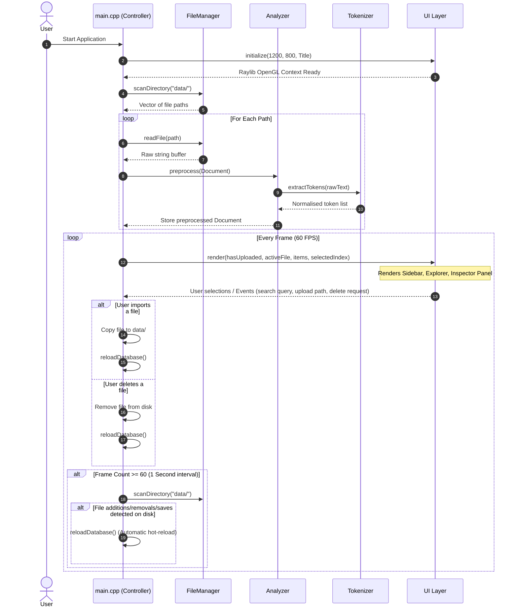
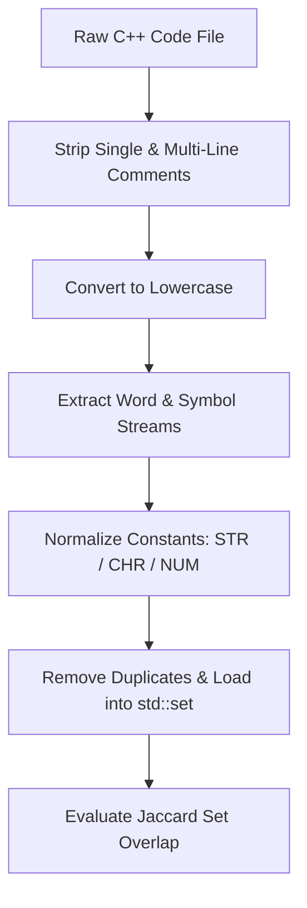

# Code Plagiarism Guard - System Architecture & OOP Design

This document details the software architecture, object-oriented design patterns, execution pipelines, and logical workflows of the **Code Plagiarism Guard** application.

---

## 1. System Architecture Diagram

The project is structured under the `pd` namespace. It follows a modular structure where responsibility is separated cleanly between file management, token preprocessing, mathematical comparison, and window rendering.

```mermaid
classDiagram
    namespace pd {
        class Document {
            +path : filesystem::path
            +rawText : string
            +tokens : vector~string~
        }

        class ComparisonItem {
            +path : filesystem::path
            +similarity : double
            +tokenCount : int
        }

        class FileManager {
            +scanDirectory(dir : path) : vector~path~
            +readFile(path : path) : string
        }

        class Tokenizer {
            +extractTokens(rawCode : string) : vector~string~
            -stripComments(code : string) : string
            -lowercaseText(code : string) : string
        }

        class Analyzer {
            -tokenizer : Tokenizer
            +preprocess(doc : Document&) : void
            +computeJaccard(a : Document&, b : Document&) : double
        }

        class UI {
            -screenWidth : int
            -screenHeight : int
            -scrollOffset : float
            -windowInitialized : bool
            -searchQuery : string
            -activeFilter : int
            +UI()
            +initialize(w : int, h : int, title : string) : bool
            +render(...) : string
            +shutdown() : void
        }
    }

    class MainController [main.cpp]

    %% Relationships
    Analyzer *-- Tokenizer : Composition (Analyzer HAS-A Tokenizer)
    MainController ..> Document : Uses
    MainController ..> ComparisonItem : Uses
    MainController ..> FileManager : Uses
    MainController ..> Analyzer : Uses
    MainController ..> UI : Uses
    Analyzer ..> Document : Processes
```

---

## 2. Dynamic Execution Workflow

The timeline sequence below tracks the application's runtime lifecycle, from initialization to database scans, Jaccard checks, interactive loops, and background hot-reloading directory checks:



---

## 3. Core OOP Concepts Applied

The codebase utilizes key pillars of Object-Oriented Programming (OOP) to maintain testability and cleanly separate core modules.

### A. Encapsulation & Data Hiding
Internal data structures and helper subroutines are protected from external scopes using `private` visibility specifiers. 

* **Example (`Tokenizer`)**:
  ```cpp
  class Tokenizer {
  public:
      // Exposes only a single high-level endpoint
      std::vector<std::string> extractTokens(const std::string& rawCode);

  private:
      // Inner normalization routines are hidden from outside access
      std::string stripComments(const std::string& code);
      std::string lowercaseText(const std::string& code);
  };
  ```

### B. Composition (HAS-A Relationship)
Instead of inheriting complex lexical properties, classes are combined to delegate specific responsibilities.

* **Example (`Analyzer`)**:
  `Analyzer` owns (`HAS-A`) a `Tokenizer` instance to perform structural preprocessing:
  ```cpp
  class Analyzer {
  private:
      Tokenizer tokenizer; // Composition
  public:
      void preprocess(Document& doc) {
          doc.tokens = tokenizer.extractTokens(doc.rawText); // Delegation
      }
  };
  ```

### C. Abstraction
Simplifies interaction by hiding low-level details (like file streams and drawing calculations) behind clean interfaces.
* **Example (`FileManager`)**: 
  `FileManager::readFile` handles the complexity of disk reads (`std::ifstream`, `std::stringstream`, and standard buffers). Callers simply pass a path string and receive a sanitized text buffer.

---

## 4. Processing & Matching Pipeline

To defeat common structural renaming tactics (variable swaps, comment injection, and spacing shifts), source code goes through a processing pipeline before comparison:



### The Mathematical Similarity Model
The structural overlap is computed using the **Jaccard Index**:

$$J(A, B) = \frac{|A \cap B|}{|A \cup B|}$$

1. **Intersection ($A \cap B$)**: The set of unique structural symbols and keywords present in **both** documents (the shared blueprint).
2. **Union ($A \cup B$)**: The complete combined set of all unique structural symbols and keywords present across **either** document (the total vocabulary).
3. **Calculation**: The Jaccard Index returns a similarity score from `0.0` (independent logics) to `1.0` (identical blueprint structures). Because duplicate structures are dropped during set loading, duplicating blocks or adding empty loop iterations will not alter the calculated score.

---

## 5. UI Layout Design (File Manager Style)

The Raylib window operates at a `1200x800` resolution, structured into a clean three-column desktop Explorer layout:

```
+-----------------------------------------------------------------------------------------------------+
|                      C O D E   P L A G I A R I S M   G U A R D                                      |
+----------------------------------------+------------------------------------+-----------------------+
|  LOGO & PLAGIARISM MANAGER             |  🔍 Search files by name...        |  FILE INSPECTOR       |
|                                        +------------------------------------+                       |
|  CATEGORIES                            |  FILE EXPLORER                     |  Selected File Details|
|  📂 All Files (Badge Count)            |  Name                  Similarity  |  Tokens / Node Sizes  |
|  🔴 High Risk (Badge Count)            |  [Icon] CV_CR.cpp          84.2%   |                       |
|  🟡 Mod Risk (Badge Count)             |  [Icon] Complex.cpp        60.0%   |  [ LARGE CIRCULAR ]   |
|  🟢 Clean Files (Badge Count)          |  [Icon] multiply.cpp       26.1%   |  [ SIMILARITY RING]   |
|                                        |  [Icon] hello.cpp           0.0%   |  [     84.2%      ]   |
|  ACTIONS                               |                                    |                       |
|  📤 Audit External File                |                                    |  RISK STATUS BADGE    |
|  ➕ Import File to DB                  |                                    |  Detailed Description |
|  🔄 Reset Dashboard                    |                                    |                       |
|                                        |                                    |  🗑️ Delete File     |
+----------------------------------------+------------------------------------+-----------------------+
```
