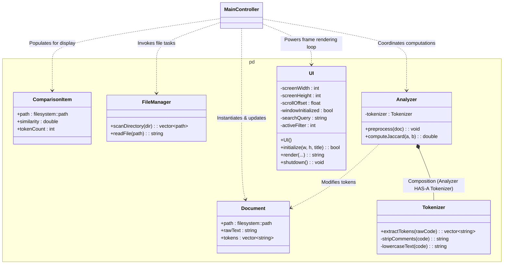
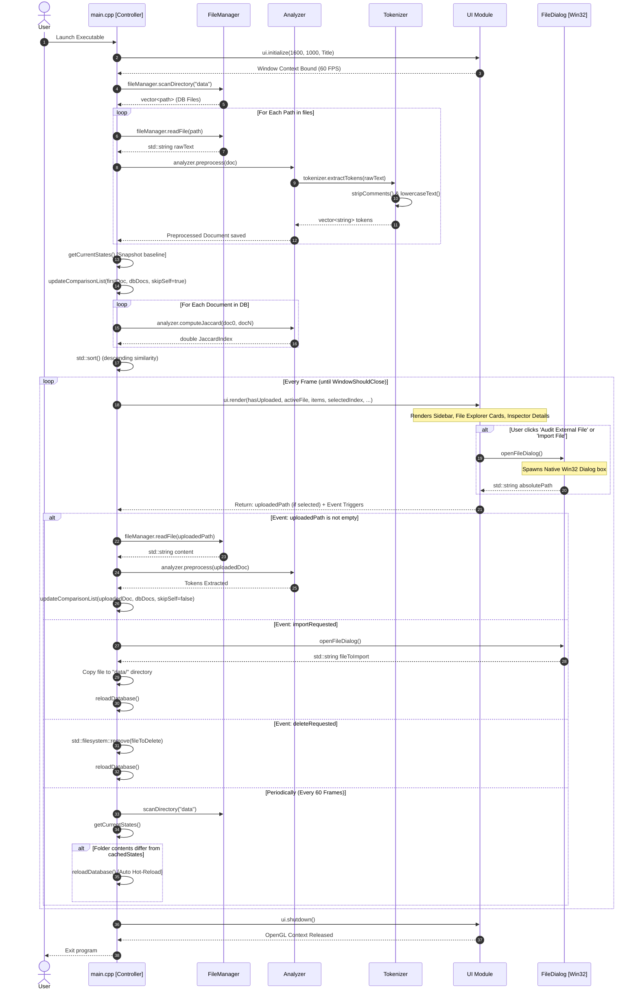

# Plagiarism Detection System: Architecture & Implementation Documentation

This document provides a comprehensive technical overview of the C++ Plagiarism Detection System. It describes the design patterns, classes, structs, functions, data flow, and runtime invocation sequence of the application.

---

## 1. System Architecture Overview

The Plagiarism Detection System is organized under the `pd` namespace to avoid symbol name collisions with external libraries (Raylib for graphics and the Windows API for the file dialog).

The application operates as a **desktop tool** featuring:
1. **File Management**: Scans a specific folder (`data/`) for candidate files and reads their contents.
2. **Lexical Preprocessing (Tokenization)**: Converts raw source code into a clean, normalized list of structural units (tokens).
3. **Similarity Analysis**: Evaluates the Jaccard similarity index between pairs of token sets.
4. **Interactive GUI**: Renders a three-column dashboard layout (Sidebar, Explorer, Inspector) using Raylib.
5. **Real-time File Monitor**: A directory watcher that triggers hot-reloads of the database when additions, updates, or deletions are detected on disk.

---

## 2. Classes and Structs Reference

### 2.1 Model Components (Plain Old Data Structs)

#### [Document](file:///c:/Users/saksham/.vscode/MARK/Project-2/include/Document.hpp#L9-L13)
* **Location**: Defined in [Document.hpp](file:///c:/Users/saksham/.vscode/MARK/Project-2/include/Document.hpp)
* **Purpose**: Holds the representation of a file throughout its loading, tokenization, and comparison stages.
* **Fields**:
  * `std::filesystem::path path`: Path indicating the file's location.
  * `std::string rawText`: Unmodified character string read directly from the disk.
  * `std::vector<std::string> tokens`: Clean, parsed syntax units generated during preprocessing.

#### [ComparisonItem](file:///c:/Users/saksham/.vscode/MARK/Project-2/include/UI.hpp#L10-L14)
* **Location**: Defined in [UI.hpp](file:///c:/Users/saksham/.vscode/MARK/Project-2/include/UI.hpp)
* **Purpose**: Represents a ranked match result displayed in the UI.
* **Fields**:
  * `std::filesystem::path path`: Target file path from the database.
  * `double similarity`: Computed Jaccard score representing overlap percentage `[0.0, 1.0]`.
  * `int tokenCount`: Total structural tokens present in this candidate file.

#### [FileState](file:///c:/Users/saksham/.vscode/MARK/Project-2/main.cpp#L25-L36)
* **Location**: Defined in [main.cpp](file:///c:/Users/saksham/.vscode/MARK/Project-2/main.cpp)
* **Purpose**: Track modification records of files in `data/` to determine if a hot-reload is necessary.
* **Fields**:
  * `std::filesystem::path path`: Path of the watched file.
  * `std::filesystem::file_time_type lastWriteTime`: Standard clock timestamp of the last modify/write cycle.
* **Operators**:
  * `operator==` & `operator!=`: Support basic vector state comparisons.

---

### 2.2 Processing & Execution Components

#### [FileManager](file:///c:/Users/saksham/.vscode/MARK/Project-2/include/FileManager.hpp#L9-L13)
* **Location**: [FileManager.hpp](file:///c:/Users/saksham/.vscode/MARK/Project-2/include/FileManager.hpp) / [FileManager.cpp](file:///c:/Users/saksham/.vscode/MARK/Project-2/src/FileManager.cpp)
* **Purpose**: Abstracts filesystem directory sweeps and standard IO stream reading operations.
* **Methods**:
  * `std::vector<std::filesystem::path> scanDirectory(const std::filesystem::path& dir)`: Validates directory existence. Scans it, filtering specifically for `.cpp` and `.txt` files.
  * `std::string readFile(const std::filesystem::path& path)`: Opens a secure `std::ifstream`, reads the buffer stream into a `std::stringstream`, and returns it as a single flat string.

#### [Tokenizer](file:///c:/Users/saksham/.vscode/MARK/Project-2/include/Tokenizer.hpp#L9-L18)
* **Location**: [Tokenizer.hpp](file:///c:/Users/saksham/.vscode/MARK/Project-2/include/Tokenizer.hpp) / [Tokenizer.cpp](file:///c:/Users/saksham/.vscode/MARK/Project-2/src/Tokenizer.cpp)
* **Purpose**: Performs lexical parsing, turning raw C++ characters into standardized tokens while discarding comments and white spaces.
* **Public Methods**:
  * `std::vector<std::string> extractTokens(const std::string& rawCode)`: Iterates character-by-character over a comment-stripped string, extracting identifiers, keywords, special operators, and constant indicators.
* **Private Helper Methods**:
  * `std::string stripComments(const std::string& code)`: Removes single-line (`//`) and multi-line (`/* */`) comments. Normalizes string text and char values to `"STR"` and `"CHR"`.
  * `std::string lowercaseText(const std::string& code)`: Converts text to lowercase to prevent casing differences from skewing plagiarism checks.

#### [Analyzer](file:///c:/Users/saksham/.vscode/MARK/Project-2/include/Analyzer.hpp#L8-L19)
* **Location**: [Analyzer.hpp](file:///c:/Users/saksham/.vscode/MARK/Project-2/include/Analyzer.hpp) / [Analyzer.cpp](file:///c:/Users/saksham/.vscode/MARK/Project-2/src/Analyzer.cpp)
* **Purpose**: Compares tokenized files mathematically. Contains an internal `Tokenizer` object as a member variable (Composition).
* **Methods**:
  * `void preprocess(Document& doc)`: Feeds raw text to the internal tokenizer and populates `doc.tokens`.
  * `double computeJaccard(const Document& a, const Document& b)`: Translates token lists into `std::set` structures to eliminate duplicates. Uses `std_intersection` and `std_union` algorithms to calculate:
    $$J(A, B) = \frac{|A \cap B|}{|A \cup B|}$$

#### [UI](file:///c:/Users/saksham/.vscode/MARK/Project-2/include/UI.hpp#L23-L54)
* **Location**: [UI.hpp](file:///c:/Users/saksham/.vscode/MARK/Project-2/include/UI.hpp) / [UI.cpp](file:///c:/Users/saksham/.vscode/MARK/Project-2/src/UI.cpp)
* **Purpose**: Powers window lifecycle operations, handles keyboard search queries, tracks sidebar options, and renders graphics at 60 FPS using Raylib.
* **Methods**:
  * `UI()`: Constructor.
  * `bool initialize(int width, int height, const std::string& title)`: Sets window constraints and configures the OpenGL target frame rate.
  * `std::string render(...)`: Main rendering pass. Updates the layout, measures metrics, manages mouse hover states, supports scrolling, and handles user interactions (button triggers, deletions).
  * `void shutdown()`: Closes the active Raylib rendering context.

---

## 3. Global & Controller Functions

These helper routines are defined globally in source files or headers to handle OS tasks or coordinate modules.

#### [openFileDialog](file:///c:/Users/saksham/.vscode/MARK/Project-2/include/FileDialog.hpp#L10)
* **Location**: [FileDialog.hpp](file:///c:/Users/saksham/.vscode/MARK/Project-2/include/FileDialog.hpp) / [FileDialog.cpp](file:///c:/Users/saksham/.vscode/MARK/Project-2/src/FileDialog.cpp)
* **Purpose**: Opens a native Windows File Chooser dialog to select external source files.
* **Key Details**: Uses the `GetOpenFileNameA` function from the Windows API (`commdlg.h`). Configured with the `OFN_NOCHANGEDIR` flag to prevent changing the application's working directory, ensuring relative paths (like `data/`) remain valid.

#### [getCurrentStates](file:///c:/Users/saksham/.vscode/MARK/Project-2/main.cpp#L39-L51)
* **Location**: [main.cpp](file:///c:/Users/saksham/.vscode/MARK/Project-2/main.cpp)
* **Purpose**: Creates an array of file records containing paths and write timestamps. Used to detect changes on disk.

#### [updateComparisonList](file:///c:/Users/saksham/.vscode/MARK/Project-2/main.cpp#L54-L77)
* **Location**: [main.cpp](file:///c:/Users/saksham/.vscode/MARK/Project-2/main.cpp)
* **Purpose**: Iterates over all loaded database files, calculates their Jaccard similarity against an active source file, and sorts the list in descending order.

---

## 4. Execution Call Chain and Lifecycle

The sequence diagram below displays the step-by-step timeline of function calls during the program lifecycle:

### Detailed Control Logic in `main()`

1. **Initialization**: Instantiates local service instances (`fileManager`, `analyzer`, `ui`), sets up the Raylib screen viewport at `1600x1000`, scans `data/` for code archives, reads them, and normalizes them into token arrays.
2. **Directory Watcher State Setup**: Calls `getCurrentStates` to capture write times for all files in the target directory. This vector is saved as `cachedStates`.
3. **Initial Comparison (Baseline)**: If at least two documents exist in the database, the program sets the first file (`dbDocs[0]`) as the default active document and ranks the remaining files against it.
4. **Main Application Loop**:
   * **Directory Watcher (Every 60 frames)**: Periodically scans the directory and compares the current file states against `cachedStates`. If a difference is found, it calls the `reloadDatabase` lambda function.
     * **`reloadDatabase`**: Re-scans `data/`, reads and preprocesses all documents, updates `cachedStates`, and updates the current comparison lists. It preserves the selected index and active document where possible.
   * **Frame Rendering**: Calls `ui.render(...)` to draw the GUI. This function checks for mouse and keyboard events and returns event signals (such as a selected file path from a file dialog).
   * **Event Responses**:
     * **Card Select**: If the user selects a different file card in the list, the application updates `selectedIndex`.
     * **Reset Dashboard**: Reverts the application to comparing database files against each other, clearing any uploaded files.
     * **External Upload**: If `ui.render(...)` returns a valid path, the file is loaded, preprocessed, and compared against the entire database.
     * **Import File**: Opens a file dialog. If a file is selected, it copies the file to the database folder and triggers `reloadDatabase`.
     * **Delete File**: Removes the selected file from disk and triggers `reloadDatabase`.
5. **Termination**: When the user presses `ESC` or closes the window, `WindowShouldClose()` returns true. The loop exits, calls `ui.shutdown()`, and the program terminates safely.

---

## 5. Summary Table: Function Call Map

| Caller Function | Callee Function | Location | Description |
|---|---|---|---|
| **`main()`** | `ui.initialize()` | [UI.cpp](file:///c:/Users/saksham/.vscode/MARK/Project-2/src/UI.cpp) | Initializes the Raylib window environment. |
| | `fileManager.scanDirectory()` | [FileManager.cpp](file:///c:/Users/saksham/.vscode/MARK/Project-2/src/FileManager.cpp) | Scans a directory and returns matching files. |
| | `fileManager.readFile()` | [FileManager.cpp](file:///c:/Users/saksham/.vscode/MARK/Project-2/src/FileManager.cpp) | Reads a file and returns its contents as a string. |
| | `analyzer.preprocess()` | [Analyzer.cpp](file:///c:/Users/saksham/.vscode/MARK/Project-2/src/Analyzer.cpp) | Directs the tokenizer to extract tokens from a document. |
| | `getCurrentStates()` | [main.cpp](file:///c:/Users/saksham/.vscode/MARK/Project-2/main.cpp) | Gathers directory state metadata for hot-reloading. |
| | `updateComparisonList()` | [main.cpp](file:///c:/Users/saksham/.vscode/MARK/Project-2/main.cpp) | Computes similarity scores and sorts the results list. |
| | `ui.render()` | [UI.cpp](file:///c:/Users/saksham/.vscode/MARK/Project-2/src/UI.cpp) | Renders the interface and processes interactive events. |
| | `pd::openFileDialog()` | [FileDialog.cpp](file:///c:/Users/saksham/.vscode/MARK/Project-2/src/FileDialog.cpp) | Spawns the Windows file chooser dialog. |
| | `reloadDatabase()` *(lambda)* | [main.cpp](file:///c:/Users/saksham/.vscode/MARK/Project-2/main.cpp) | Synchronizes in-memory documents with filesystem changes. |
| | `ui.shutdown()` | [UI.cpp](file:///c:/Users/saksham/.vscode/MARK/Project-2/src/UI.cpp) | Safely closes the active Raylib window. |
| **`reloadDatabase()`** | `fileManager.scanDirectory()` | [FileManager.cpp](file:///c:/Users/saksham/.vscode/MARK/Project-2/src/FileManager.cpp) | Re-scans the folder for file changes. |
| | `fileManager.readFile()` | [FileManager.cpp](file:///c:/Users/saksham/.vscode/MARK/Project-2/src/FileManager.cpp) | Reads updated contents of disk files. |
| | `analyzer.preprocess()` | [Analyzer.cpp](file:///c:/Users/saksham/.vscode/MARK/Project-2/src/Analyzer.cpp) | Tokenizes the updated files. |
| | `getCurrentStates()` | [main.cpp](file:///c:/Users/saksham/.vscode/MARK/Project-2/main.cpp) | Updates cached file state metadata. |
| | `updateComparisonList()` | [main.cpp](file:///c:/Users/saksham/.vscode/MARK/Project-2/main.cpp) | Re-ranks comparisons based on the new database state. |
| **`updateComparisonList()`**| `analyzer.computeJaccard()` | [Analyzer.cpp](file:///c:/Users/saksham/.vscode/MARK/Project-2/src/Analyzer.cpp) | Computes the similarity score between two documents. |
| **`analyzer.preprocess()`**| `tokenizer.extractTokens()` | [Tokenizer.cpp](file:///c:/Users/saksham/.vscode/MARK/Project-2/src/Tokenizer.cpp) | Standardizes code characters into parsed tokens. |
| **`tokenizer.extractTokens()`**| `tokenizer.stripComments()` | [Tokenizer.cpp](file:///c:/Users/saksham/.vscode/MARK/Project-2/src/Tokenizer.cpp) | Strips comments and placeholder formats code segments. |
| | `tokenizer.lowercaseText()` | [Tokenizer.cpp](file:///c:/Users/saksham/.vscode/MARK/Project-2/src/Tokenizer.cpp) | Lowercases characters to normalize comparisons. |
| **`ui.render()`** | `pd::openFileDialog()` | [FileDialog.cpp](file:///c:/Users/saksham/.vscode/MARK/Project-2/src/FileDialog.cpp) | Opens the file chooser dialog for the upload option. |
| | `drawSidebarTab()` *(lambda)* | [UI.cpp](file:///c:/Users/saksham/.vscode/MARK/Project-2/src/UI.cpp) | Draws sidebar selection categories. |
| | `drawButton()` *(lambda)* | [UI.cpp](file:///c:/Users/saksham/.vscode/MARK/Project-2/src/UI.cpp) | Draws buttons and checks for hover and click events. |
| | `drawFilterIcon()` | [UI.cpp](file:///c:/Users/saksham/.vscode/MARK/Project-2/src/UI.cpp) | Renders category icons in the sidebar. |
| | `drawFileIcon()` | [UI.cpp](file:///c:/Users/saksham/.vscode/MARK/Project-2/src/UI.cpp) | Renders file document vector icons. |
